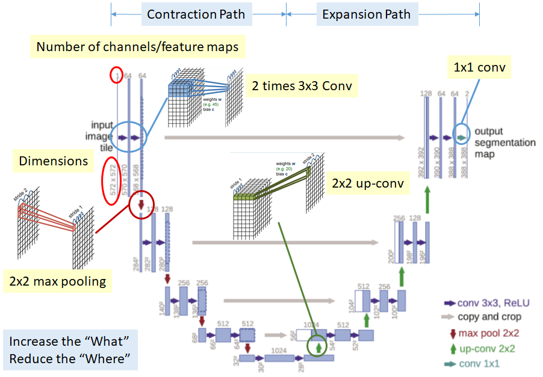
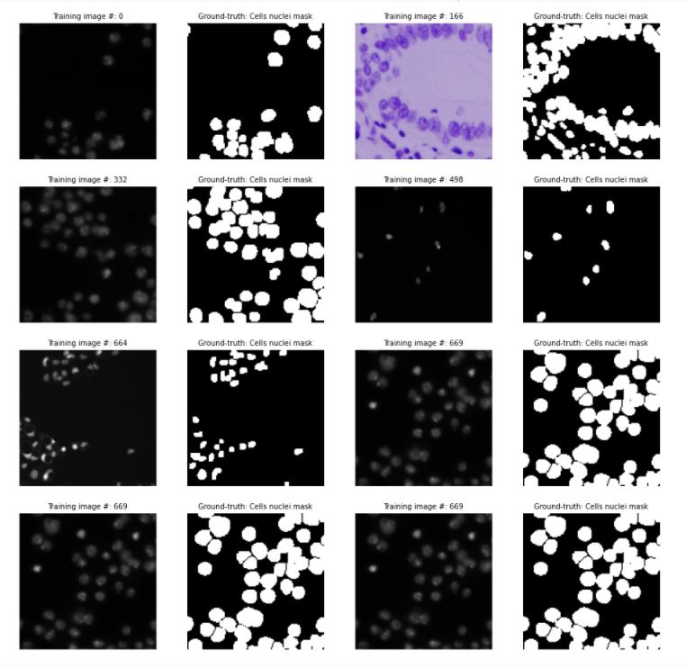
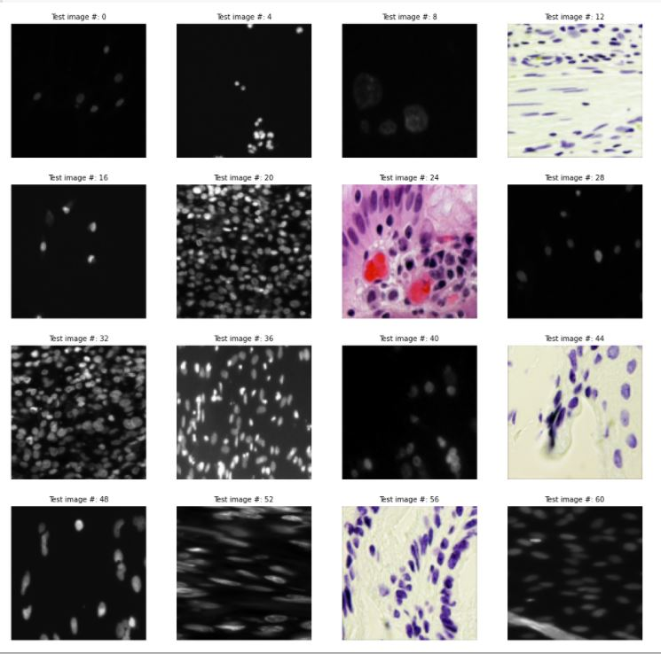
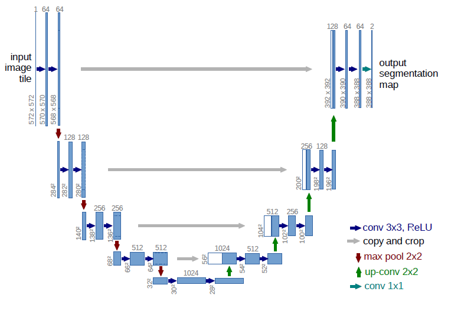
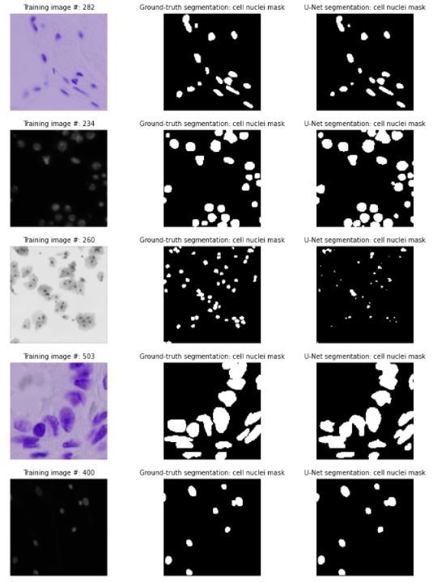
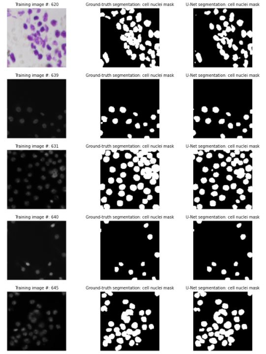
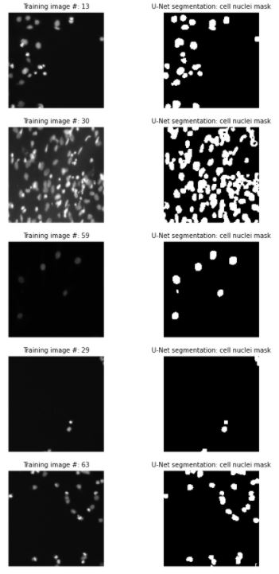

# Cell-Nuclei Segmentation using U-Net in Python

## 1. Objective

The objective of this project is to develop, train and evaluate the performance of a U-Net model to segment cells' nuclei from medical cell images.

## 2. Motivation

A human body’s has in the order of 30 trillion cells:

  * Each cell contain a nucleus full of DNA, the genetic code that programs each cell.
  * Identifying the cells’ nuclei is the starting point for most analyses
  * Identifying nuclei allows researchers to identify each individual cell in a sample
  * Measuring how cells react to various treatments, the researcher can understand the underlying biological processes at work.

Thus, identifying cells' nuclei is often a critical first step in analyzing microscopy images of cells, and classical image processing algorithms are most commonly used for this task. Recent developments in deep learning can yield superior accuracy.

In this work, we demonstrate the end-to-end process of segmenting cells' nuclei using U-Net. 

## 3. Data

In order to accomplish our task, we use the following dataset:

* Kaggle 2018 Data Science Bowl competition:
* Objective: Find the nuclei in divergent images to advance medical discovery
* Link: https://www.kaggle.com/c/data-science-bowl-2018/data

The dataset contains a large number of segmented nuclei images:

* Training data subset:
  * 670 nuclei cell annotated images (in the sub-folder: \images)
  * For each image, ground-truth annotation masks associated with each nucleus cell ((in the sub-folder: \masks).

* Test data subset:
  * 65 images without ground-truth (in the sub-folder: \images).
  * The images were acquired under a variety of conditions and vary in the cell type, magnification, and imaging modality (bright-field vs. fluorescence)

The dataset is designed to challenge an algorithm's ability to generalize across these variations.

4. Development

In this section, we shall develop, train, deploy and evaluate the performance of a CNN model to classify malaria cells into parasitized (0) or uninfected (1).

  * Author: Mohsen Ghazel (mghazel)
  * Date: April 1st, 2021
  * Project: Cell nuclei segmentation using U-Net:

The this project, we develop a U-Net to detect and segment cells’ nuclei:

  * A human body’s has in the order of 30 trillion cells:
  * Each cell contain a nucleus full of DNA, the genetic code that programs each cell.
  * Identifying the cells’ nuclei is the starting point for most analyses because
  * Identifying nuclei allows researchers to identify each individual cell in a sample
  * Measuring how cells react to various treatments, the researcher can understand the underlying biological processes at work.
  * We shall demonstrate the end-to-end process of segmenting cells' nuclei using U-Net.
  
### 4.1. Step 1: Python imports and global variables
#### 4.1.1/ Imports:

<pre style="color:#000000;background:#e6ffff;font-size:10px;line-height:1.5;">print(__doc__)

Automatically created module for IPython interactive environment
</pre>

<pre style="color:#000000;background:#e6ffff;font-size:10px;line-height:1.5;"># Numpy
import numpy as np
# matplot lib
import matplotlib.pyplot as plt
# opencv
import cv2
# PIL library
from PIL import Image
# tensorflow
import tensorflow as tf
# keras
import keras

# sklearn imports
# - nededed for splitting the dataset into training and testing subsets
from sklearn.model_selection import train_test_split
# - nededed for 1-hot coding of the image labels
from keras.utils import to_categorical

# tqdm
from tqdm import tqdm 

# skimage
# read and imshow
from skimage.io import imread, imsave, imshow
# resize
from skimage.transform import resize

# Image package
from IPython.display import Image
# using HTML code
from IPython.core.display import HTML 

# set the keras backend to tensorflow
# os.environ['KERAS_BACKEND'] = 'tensorflow'
# I/O
import os
# sys
import sys

# datetime
import datetime

# random
import random

# check for successful package imports and versions
# python
print("Python version : {0} ".format(sys.version))
# OpenCV
print("OpenCV version : {0} ".format(cv2.__version__))
# numpy
print("Numpy version  : {0}".format(np.__version__))
</pre>

<pre style="color:#000000;background:#e6ffff;font-size:10px;line-height:1.5;">Mounted at /content/drive
</pre>

### 4.1.2. Global variables

<pre style="color:#000000;background:#e6ffff;font-size:10px;line-height:1.5;">#-------------------------------------------------------------------------------
# We set the Numpy pseudo-random generator at a fixed value:
#-------------------------------------------------------------------------------
# - This ensures repeatable results everytime you run the code. 
# the seed 
RANDOM_SEED = 101
# set the random seed
np.random.seed = RANDOM_SEED

#-------------------------------------------------------------------------------
# Set the random state to 101
#-------------------------------------------------------------------------------
# - This ensures repeatable results every time you run the code. 
RANDOM_STATE = 101

#-------------------------------------------------------------------------------
# Set the sample images path
#-------------------------------------------------------------------------------
# - contains sample images such as the implemented U-Net structure
SAMPLE_IMAGES_PATH = "/content/drive/.../sample-images/"

#-------------------------------------------------------------------------------
# Set the data directory where cell-nuclei data sets are stored
#-------------------------------------------------------------------------------
# training images
TRAIN_IMAGES_PATH = '/content/drive/.../cell-nuclei-data/stage1_train/'

# test images
TEST_IMAGES_PATH = '/content/drive/.../cell-nuclei-data/stage1_test/'

#-------------------------------------------------------------------------------
# Set the input images size: RGB images with size: 128x128 pixels
#-------------------------------------------------------------------------------
# input image-width
INPUT_IMAGE_WIDTH = 128
# input image-width
INPUT_IMAGE_HEIGHT = 128
# input image-channels
INPUT_IMAGE_CHANNELS = 3

#-------------------------------------------------------------------------------
# A flag to combine seperate ground-truth cell-nuclei masks into one 
# common mask:
#-------------------------------------------------------------------------------
# - Set this flag to 1 to combine
# - Set this flag to 0 to use the already combined mask
#-------------------------------------------------------------------------------
COMBINE_GROUND_TRUTH_MASKS = 1
# the name of tthe file of the combined mask
COMBINED_MASK_FILE_NAME = 'combined_gt_mask.png'
</pre>

### 4.2. Step 2: Read, resize and visualize the input data set

* We use the following dataset:

  * Kaggle 2018 Data Science Bowl:
  * Objective: Find the nuclei in divergent images to advance medical discovery
  Link: https://www.kaggle.com/c/data-science-bowl-2018/data
  * The dataset contains a large number of segmented nuclei images:
      * Training data subset:
        * 670 nuclei cell annotated images (in the sub-folder: \images)
            * For each image, ground-truth annotation masks associated with each nucleus cell ((in the sub-folder: \masks).
      * Test data subset:
        * 65 images without ground-truth (in the sub-folder: \images).
        * The images were acquired under a variety of conditions and vary in the cell type, magnification, and imaging modality (bright-field vs. fluorescence)
        * The dataset is designed to challenge an algorithm's ability to generalize across these variations.

#### 4.2.1. Create data structures to store the read input data:

* There are 670 nuclei cell annotated images (in the sub-folder: \images):
* For each image, ground-truth annotation masks associated with each nucleus cell ((in the sub-folder: \masks

##### 4.2.1.1/ Read and resize the input training images:

<pre style="color:#000000;background:#e6ffff;font-size:10px;line-height:1.5;">#-------------------------------------------------------------------------------
# The structure of the training-data folder is as follows:
#-------------------------------------------------------------------------------
# - For each training image: 
#
#  - \stage1_train\52b267e20519174e3ce1e1994b5d677804b16bc670aa5f6ffb6344a0fdf63fde\images
#  - \stage1_train\52b267e20519174e3ce1e1994b5d677804b16bc670aa5f6ffb6344a0fdf63fde\masks
#
#-------------------------------------------------------------------------------
# This needs to be parsed to extract the the ID for each image:
#
#    52b267e20519174e3ce1e1994b5d677804b16bc670aa5f6ffb6344a0fdf63fde
#
#-------------------------------------------------------------------------------
# display a message
print("\n-------------------------------------------------------------------------")
print("Reading and formatting the training images:")
print("-------------------------------------------------------------------------")
# extract the IDs for the training images
train_ids = next(os.walk(TRAIN_IMAGES_PATH))[1]

# the number of train images
num_train_images = len(train_ids)
# display a message
print("The number of train images = {0}".format(num_train_images))
#-------------------------------------------------------------------------------
# Allocate a data structure to store the read and resized train images: 
#-------------------------------------------------------------------------------
# 1) 4D numpy array to store the images:
#     - The number of training images: (len(train_ids)
#     - Each training image will be resized to: 
#       - INPUT_IMAGE_HEIGHT x INPUT_IMAGE_WIDTH x INPUT_IMAGE_CHANNELS
#-------------------------------------------------------------------------------
X_train = np.zeros((len(train_ids), 
                    INPUT_IMAGE_HEIGHT, 
                    INPUT_IMAGE_WIDTH, 
                    INPUT_IMAGE_CHANNELS), dtype=np.uint8)
#-------------------------------------------------------------------------------
# 2) 3D numpy array to store the masks:
#     - The number of training images: (len(train_ids)
#     - Each training grayscale/binary image-mask will be resized to: 
#       - INPUT_IMAGE_HEIGHT x INPUT_IMAGE_WIDTH x 1
#-------------------------------------------------------------------------------
Y_train = np.zeros((len(train_ids), 
                    INPUT_IMAGE_HEIGHT, 
                    INPUT_IMAGE_WIDTH, 1), 
                   dtype=np.bool)

#-------------------------------------------------------------------------------
# Save the common mask:
#------------------------------------------------------------------------------- 
# Once the seperate masks are combined together, save the combined mask:
#------------------------------------------------------------------------------- 
# - This will speed up the prcessing
# - It is very slow to read the many individual masks
# - Instead, we just read the combined mask
#------------------------------------------------------------------------------- 
# the combined mask name
combined_mask_name = 'combined_mask.png';

#-------------------------------------------------------------------------------
# Read and resize each training image
#-------------------------------------------------------------------------------
# iterate over the training-images IDs
for n, id_ in tqdm(enumerate(train_ids), total=len(train_ids)):
    # set the path of the next training image
    path = TRAIN_IMAGES_PATH + id_
    # read the next train image
    img = imread(path + '/images/' + id_ + '.png')[:,:,:INPUT_IMAGE_CHANNELS]
    #---------------------------------------------------------------------------
    # resize the read training image to the specified desired size:
    #---------------------------------------------------------------------------
    # - INPUT_IMAGE_HEIGHT x INPUT_IMAGE_WIDTH
    #---------------------------------------------------------------------------
    img = resize(img, (INPUT_IMAGE_HEIGHT, 
                       INPUT_IMAGE_WIDTH), 
                       mode='constant', 
                       preserve_range=True)
    # store the resized train image in the X_train 4D arrays 
    X_train[n] = img
    #---------------------------------------------------------------------------
    # The ground-truth annotation masks stored in /masks subfolder:
    #---------------------------------------------------------------------------
    #  - A seperate mask is prvided for each cell nucleus in the image
    #  - These masks need to be merged together into one mask
    #---------------------------------------------------------------------------
    # initialize the common mask
    mask = np.zeros((INPUT_IMAGE_HEIGHT, INPUT_IMAGE_WIDTH, 1), dtype=np.bool)
    #---------------------------------------------------------------------------
    # Check if we need to combined the masks into a single common mask:
    #---------------------------------------------------------------------------
    if ( COMBINE_GROUND_TRUTH_MASKS == 1 ):
        #-----------------------------------------------------------------------
        # Read and combined the individual masks into one mask:
        #-----------------------------------------------------------------------
        # iterate over each eask mask file in the /masks sub-folder
        for mask_file in next(os.walk(path + '/masks/'))[2]:
            # read the new mask image
            mask_ = imread(path + '/masks/' + mask_file)
            #-------------------------------------------------------------------
            # Resize the mask image as done for the image:
            #-------------------------------------------------------------------
            # - Each training grayscale/binary image-mask will be resized to: 
            # - INPUT_IMAGE_HEIGHT x INPUT_IMAGE_WIDTH x 1 
            #-------------------------------------------------------------------
            mask_ = np.expand_dims(resize(mask_, (INPUT_IMAGE_HEIGHT, 
                                                  INPUT_IMAGE_WIDTH), mode='constant',  
                                                  preserve_range=True), axis=-1)
            #-------------------------------------------------------------------
            # Append this resized new mask image to the combined mask image:
            #-------------------------------------------------------------------
            # - This is done by taking the max() operator between the 2 masks
            #-------------------------------------------------------------------
            mask = np.maximum(mask, mask_)  
        #-----------------------------------------------------------------------
        # Store the combined cell nuclei mask:
        #-----------------------------------------------------------------------
        Y_train[n] = mask 
        #-----------------------------------------------------------------------
        # Save the combined mask to file
        #-----------------------------------------------------------------------
        # the full-path file
        combined_mask_full_path_file_name = path + '/masks/' + COMBINED_MASK_FILE_NAME
        # save the combined mask image
        imsave(combined_mask_full_path_file_name, np.uint8(mask)) 
    #-----------------------------------------------------------------------------
    # If the masks have already been combined into a single common mask:
    #-----------------------------------------------------------------------------
    else: 
        #-----------------------------------------------------------------------
        # Read the combined mask
        #-----------------------------------------------------------------------
        # the full-path file
        combined_mask_full_path_file_name = path + '/masks/' + COMBINED_MASK_FILE_NAME
        # read the combined mask image
        mask = imread(combined_mask_full_path_file_name) 
        #-----------------------------------------------------------------------
        # Store the combined cell nuclei mask:
        #-----------------------------------------------------------------------
        Y_train[n] = mask 

#-------------------------------------------------------------------------------
# display a message
#-------------------------------------------------------------------------------
print("\nTraining images and ground-truth masks are read, resized and stored successfully!")
</pre>

<pre style="color:#000000;background:#e6ffff;font-size:10px;line-height:1.5;">-------------------------------------------------------------------------
Reading and formatting the training images:
-------------------------------------------------------------------------
The number of train images = 670
</pre>

##### 4.2.1.2. Visualize 8 sample training images:

* Visualize 8 sample training images and their associated cell nuclei masks:

<pre style="color:#000000;background:#e6ffff;font-size:10px;line-height:1.5;">#-----------------------------------------------------------------
# - Visualize 8 cell nuclei training images and their associated 
#   ground-truth cell neclei masks:
#-----------------------------------------------------------------
# set the number of skipped images
# - integer division
NUM_SKIPPED_IMAGES = num_train_images // 8
# specify the overall grid size
plt.figure(figsize=(16,16)) 
plt.title("Cell nuclei test images", fontsize=12)
# iterate over the 16 images
for i in range(0, 16, 2): 
    # image counter 
    image_counter = np.min([i * NUM_SKIPPED_IMAGES, num_train_images - 1])
    #---------------------------------------------------------------------------
    # step 1: create the subplot for the image 
    #---------------------------------------------------------------------------
    plt.subplot(4,4,i+1)  
    # display the image
    plt.imshow(X_train[image_counter])
    # figure title
    plt.title("Training image #: " + str(image_counter), fontsize=10)
    # turn-off axes
    plt.axis('off')
    #---------------------------------------------------------------------------
    # step 2: create the subplot for the image ground-truth cell nuclei mask
    #---------------------------------------------------------------------------
    plt.subplot(4,4,i+2)  
    # display the image
    plt.imshow(np.squeeze(Y_train[image_counter]), cmap='gray')
    # figure title
    plt.title("Ground-truth: Cells nuclei mask", fontsize=10)
    # turn-off axes
    plt.axis('off')
</pre>

#### 4.2.2. Read, resize and visualize the test data subset:

* There are 65 test images
* Test images do not have ground-truth segmentation masks.

##### 4.2.2.1. Read and resize the test images:

<pre style="color:#000000;background:#e6ffff;font-size:10px;line-height:1.5;">#-------------------------------------------------------------------------------
# The structure of the test-data folder is as follows:
#-------------------------------------------------------------------------------
# - For each test image: 
#
#  ...\stage1_test\0a849e0eb15faa8a6d7329c3dd66aabe9a294cccb52ed30a90c8ca99092ae732\images
#
#-------------------------------------------------------------------------------
# This needs to be parsed to extract the the ID for each image:
#
#    0a849e0eb15faa8a6d7329c3dd66aabe9a294cccb52ed30a90c8ca99092ae732
#
#-------------------------------------------------------------------------------
# display a message
print("\n-------------------------------------------------------------------------")
print("Reading and formatting the test images:")
print("-------------------------------------------------------------------------")
# extract the IDs for the test images
test_ids = next(os.walk(TEST_IMAGES_PATH))[1]

# the number of test images
num_test_images = len(test_ids)
# display a message
print("The number of test images = {0}".format(num_test_images))
#-------------------------------------------------------------------------------
# Allocate a data structure to store the read and resized test images: 
#-------------------------------------------------------------------------------
# - 4D numpy array to store:
#   - The number of test images: (len(test_ids)
#   - Each test image is: INPUT_IMAGE_HEIGHT x INPUT_IMAGE_WIDTH x INPUT_IMAGE_CHANNELS
#-------------------------------------------------------------------------------
X_test = np.zeros((len(test_ids), 
                   INPUT_IMAGE_HEIGHT, 
                   INPUT_IMAGE_WIDTH, 
                   INPUT_IMAGE_CHANNELS), 
                  dtype=np.uint8)

#-------------------------------------------------------------------------------
# Allocate a structure to store the original size of the test images
#-------------------------------------------------------------------------------
sizes_test = []

#-------------------------------------------------------------------------------
# Read and resize each test image
#-------------------------------------------------------------------------------
# iterate over the test-images IDs
for n, id_ in tqdm(enumerate(test_ids), total=len(test_ids)):
    # set the path of the next test image
    path = TEST_IMAGES_PATH + id_
    # read the next test image
    img = imread(path + '/images/' + id_ + '.png')[:,:,:INPUT_IMAGE_CHANNELS]
    # store its original size and append ut to the sizes_test list
    sizes_test.append([img.shape[0], img.shape[1]])
    # resize the read test image to the specified desired size:
    # - INPUT_IMAGE_HEIGHT x INPUT_IMAGE_WIDTH
    img = resize(img, (INPUT_IMAGE_HEIGHT, INPUT_IMAGE_WIDTH), mode='constant', preserve_range=True)
    # store the resized test image in the X_test 4D arrays 
    X_test[n] = img

#-------------------------------------------------------------------------------
# display a message
#-------------------------------------------------------------------------------
print("\nTest images read, resized and stored successfully!")
</pre>

##### 4.2.2.2. Visualize 16 sample test images:

<pre style="color:#000000;background:#e6ffff;font-size:10px;line-height:1.5;">#-----------------------------------------------------------------
# - Visualize 16 cell nuclei test images:
#-----------------------------------------------------------------
# set the number of skipped images
# - integer division
NUM_SKIPPED_IMAGES = num_test_images // 16
# specify the overall grid size
plt.figure(figsize=(16,16)) 
plt.title("Cell nuclei test images", fontsize=12)
# iterate over the 16 images
for i in range(16):
    # image counter 
    image_counter = np.min([i * NUM_SKIPPED_IMAGES, num_test_images - 1])
    # create the subplot for the next image
    plt.subplot(4,4,i+1)   
    # display the image
    plt.imshow(X_test[image_counter])
    # figure title
    plt.title("Test image #: " + str(image_counter), fontsize=10)
    # set axis off
    plt.axis('off')
</pre>

### 4.3. Step 3: Build the U-Net model:

* Build the U-Net model:
  * A sequence of convolutional and pooling layers
  * With some some normalization and dropout layers in between
  * Experiment with different structures and hyper parameters

#### 4.3.1. Display the structure of the implemented U-Net model:

<pre style="color:#000000;background:#e6ffff;font-size:10px;line-height:1.5;">#-------------------------------------------------------------------------------
# Display the structure of the implemented U-Net:
#-------------------------------------------------------------------------------
# set the image dimensions and preserve its aspect-ratio:
#-------------------------------------------------------------------------------
# height
img_height = 400
# width
img_width = 600
# display the image
Image(filename = SAMPLE_IMAGES_PATH + "Implemented-U-Net.JPG", width=img_width, height=img_height)
</pre>

#### 4.3.2. Define the U-Net model layers:

<pre style="color:#000000;background:#e6ffff;font-size:10px;line-height:1.5;">#-------------------------------------------------------------------------------
# Define sequential layers of the U-Net model:
#-------------------------------------------------------------------------------
# 1) Input layer with image size: 
#    - INPUT_IMAGE_HEIGHT, INPUT_IMAGE_WIDTH, INPUT_IMAGE_CHANNELS
#-------------------------------------------------------------------------------
inputs = tf.keras.layers.Input((INPUT_IMAGE_HEIGHT, INPUT_IMAGE_WIDTH, INPUT_IMAGE_CHANNELS))
# normalize the input image to the interval: [0,1]
s = tf.keras.layers.Lambda(lambda x: x / 255)(inputs)

#-------------------------------------------------------------------------------
# 2) Contaction path:
#-------------------------------------------------------------------------------
# 2.1) Convolutional layers: C1 and P1
#-------------------------------------------------------------------------------
# Convolution layer with 32 filters of size: 3x3 and preserve image size 
c1 = tf.keras.layers.Conv2D(16, (3, 3), activation='relu', kernel_initializer='he_normal', padding='same')(s)
# Apply 10 % dropout
c1 = tf.keras.layers.Dropout(0.1)(c1)
# Convolution layer with 16 filters of size: 3x3 and preserve image size 
c1 = tf.keras.layers.Conv2D(16, (3, 3), activation='relu', kernel_initializer='he_normal', padding='same')(c1)
# Apply 2x2 max-pooling
p1 = tf.keras.layers.MaxPooling2D((2, 2))(c1)

#-------------------------------------------------------------------------------
# 2.2) Convolutional layers: C2 and P2
#------------------------------------------------------------------------------
# Convolution layer with 32 filters of size: 3x3 and preserve image size
c2 = tf.keras.layers.Conv2D(32, (3, 3), activation='relu', kernel_initializer='he_normal', padding='same')(p1)
# Apply 10 % dropout
c2 = tf.keras.layers.Dropout(0.1)(c2)
# Convolution layer with 32 filters of size: 3x3 and preserve image size
c2 = tf.keras.layers.Conv2D(32, (3, 3), activation='relu', kernel_initializer='he_normal', padding='same')(c2)
# Apply 2x2 max-pooling
p2 = tf.keras.layers.MaxPooling2D((2, 2))(c2)

#-------------------------------------------------------------------------------
# 2.3) Convolutional layers: C3 and P3
#-------------------------------------------------------------------------------
# Convolution layer with 64 filters of size: 3x3 and preserve image size
c3 = tf.keras.layers.Conv2D(64, (3, 3), activation='relu', kernel_initializer='he_normal', padding='same')(p2)
# Apply 20 % dropout
c3 = tf.keras.layers.Dropout(0.2)(c3)
# Convolution layer with 64 filters of size: 3x3 and preserve image size
c3 = tf.keras.layers.Conv2D(64, (3, 3), activation='relu', kernel_initializer='he_normal', padding='same')(c3)
# Apply 2x2 max-pooling
p3 = tf.keras.layers.MaxPooling2D((2, 2))(c3)

#-------------------------------------------------------------------------------
# 2.4) Convolutional layers: C4 and P4
#-------------------------------------------------------------------------------
# Convolution layer with 128 filters of size: 3x3 and preserve image size
c4 = tf.keras.layers.Conv2D(128, (3, 3), activation='relu', kernel_initializer='he_normal', padding='same')(p3)
# Apply 20 % dropout
c4 = tf.keras.layers.Dropout(0.2)(c4)
# Convolution layer with 128 filters of size: 3x3 and preserve image size
c4 = tf.keras.layers.Conv2D(128, (3, 3), activation='relu', kernel_initializer='he_normal', padding='same')(c4)
# Apply 2x2 max-pooling
p4 = tf.keras.layers.MaxPooling2D(pool_size=(2, 2))(c4)

#-------------------------------------------------------------------------------
# 2.4) Convolutional layers: C5 and P5
#-------------------------------------------------------------------------------
# Convolution layer with 256 filters of size: 3x3 and preserve image size
c5 = tf.keras.layers.Conv2D(256, (3, 3), activation='relu', kernel_initializer='he_normal', padding='same')(p4)
# Apply 20 % dropout
c5 = tf.keras.layers.Dropout(0.3)(c5)
# Convolution layer with 256 filters of size: 3x3 and preserve image size
c5 = tf.keras.layers.Conv2D(256, (3, 3), activation='relu', kernel_initializer='he_normal', padding='same')(c5)

#-------------------------------------------------------------------------------
# 3) Expansive path:
#-------------------------------------------------------------------------------
# 3.1) Convolutional layers: U6 and C6
#-------------------------------------------------------------------------------
# Convolution layer with 128 filters of size: 2x2 and preserve image size
u6 = tf.keras.layers.Conv2DTranspose(128, (2, 2), strides=(2, 2), padding='same')(c5)
# concatenate to up-sample
u6 = tf.keras.layers.concatenate([u6, c4])
# Convolution layer with 128 filters of size: 3x3 and preserve image size
c6 = tf.keras.layers.Conv2D(128, (3, 3), activation='relu', kernel_initializer='he_normal', padding='same')(u6)
# Apply 20 % dropout
c6 = tf.keras.layers.Dropout(0.2)(c6)
# Convolution layer with 128 filters of size: 3x3 and preserve image size
c6 = tf.keras.layers.Conv2D(128, (3, 3), activation='relu', kernel_initializer='he_normal', padding='same')(c6)
#-------------------------------------------------------------------------------
# 3.2) Convolutional layers: U7 and C7
#-------------------------------------------------------------------------------
u7 = tf.keras.layers.Conv2DTranspose(64, (2, 2), strides=(2, 2), padding='same')(c6)
# concatenate to up-sample
u7 = tf.keras.layers.concatenate([u7, c3])
# Convolution layer with 64 filters of size: 3x3 and preserve image size
c7 = tf.keras.layers.Conv2D(64, (3, 3), activation='relu', kernel_initializer='he_normal', padding='same')(u7)
# Apply 20 % dropout
c7 = tf.keras.layers.Dropout(0.2)(c7)
# Convolution layer with 64 filters of size: 3x3 and preserve image size
c7 = tf.keras.layers.Conv2D(64, (3, 3), activation='relu', kernel_initializer='he_normal', padding='same')(c7)
#-------------------------------------------------------------------------------
# 3.3) Convolutional layers: U8 and C8
#-------------------------------------------------------------------------------
u8 = tf.keras.layers.Conv2DTranspose(32, (2, 2), strides=(2, 2), padding='same')(c7)
# concatenate to up-sample
u8 = tf.keras.layers.concatenate([u8, c2])
# Convolution layer with 32 filters of size: 3x3 and preserve image size
c8 = tf.keras.layers.Conv2D(32, (3, 3), activation='relu', kernel_initializer='he_normal', padding='same')(u8)
# Apply 10 % dropout
c8 = tf.keras.layers.Dropout(0.1)(c8)
# Convolution layer with 32 filters of size: 3x3 and preserve image size
c8 = tf.keras.layers.Conv2D(32, (3, 3), activation='relu', kernel_initializer='he_normal', padding='same')(c8)
#-------------------------------------------------------------------------------
# 3.4) Convolutional layers: U9 and C9
#-------------------------------------------------------------------------------
# Convolution layer with 16 filters of size: 1x2 and preserve image size
u9 = tf.keras.layers.Conv2DTranspose(16, (2, 2), strides=(2, 2), padding='same')(c8)
# concatenate to up-sample
u9 = tf.keras.layers.concatenate([u9, c1], axis=3)
# Convolution layer with 16 filters of size: 3x3 and preserve image size
c9 = tf.keras.layers.Conv2D(16, (3, 3), activation='relu', kernel_initializer='he_normal', padding='same')(u9)
# Apply 10 % dropout
c9 = tf.keras.layers.Dropout(0.1)(c9)
# Convolution layer with 16 filters of size: 3x3 and preserve image size
c9 = tf.keras.layers.Conv2D(16, (3, 3), activation='relu', kernel_initializer='he_normal', padding='same')(c9)

#-------------------------------------------------------------------------------
# 4) Output layer:
#-------------------------------------------------------------------------------
# final output layer 
outputs = tf.keras.layers.Conv2D(1, (1, 1), activation='sigmoid')(c9)
</pre>

#### 4.3.3. Construct the Keras model using the above defined layers:

<pre style="color:#000000;background:#e6ffff;font-size:10px;line-height:1.5;">#-------------------------------------------------------------------------------
# Define the Keras model using the above defined layers:
#-------------------------------------------------------------------------------
model = tf.keras.Model(inputs=[inputs], outputs=[outputs])
</pre>

#### 4.3.4. Compile the CNN model:

<pre style="color:#000000;background:#e6ffff;font-size:10px;line-height:1.5;">#-------------------------------------------------------------------------------
# Compile the model
#-------------------------------------------------------------------------------
#  - Experiment with using:
#      - binary_crossentropy: suitable for binary classification 
#      - categorical_crossentropy: suitable for multi-class classification 
#-------------------------------------------------------------------------------
model.compile(optimizer='adam', 
              loss='binary_crossentropy', 
              metrics=['accuracy'])
</pre>

#### 4.3.5. Print the model summary:

<pre style="color:#000000;background:#e6ffff;font-size:10px;line-height:1.5;">#-------------------------------------------------------------------------------
# Printout the model summary
#-------------------------------------------------------------------------------
# print model summary
print(model.summary())

Model: "model"
__________________________________________________________________________________________________
Layer (type)                    Output Shape         Param #     Connected to                     
=================================================
input_1 (InputLayer)            [(None, 128, 128, 3) 0                                            
__________________________________________________________________________________________________
lambda (Lambda)                 (None, 128, 128, 3)  0           input_1[0][0]                    
__________________________________________________________________________________________________
conv2d (Conv2D)                 (None, 128, 128, 16) 448         lambda[0][0]                     
__________________________________________________________________________________________________
dropout (Dropout)               (None, 128, 128, 16) 0           conv2d[0][0]                     
__________________________________________________________________________________________________
conv2d_1 (Conv2D)               (None, 128, 128, 16) 2320        dropout[0][0]                    
__________________________________________________________________________________________________
max_pooling2d (MaxPooling2D)    (None, 64, 64, 16)   0           conv2d_1[0][0]                   
__________________________________________________________________________________________________
conv2d_2 (Conv2D)               (None, 64, 64, 32)   4640        max_pooling2d[0][0]              
__________________________________________________________________________________________________
dropout_1 (Dropout)             (None, 64, 64, 32)   0           conv2d_2[0][0]                   
__________________________________________________________________________________________________
conv2d_3 (Conv2D)               (None, 64, 64, 32)   9248        dropout_1[0][0]                  
__________________________________________________________________________________________________
max_pooling2d_1 (MaxPooling2D)  (None, 32, 32, 32)   0           conv2d_3[0][0]                   
__________________________________________________________________________________________________
conv2d_4 (Conv2D)               (None, 32, 32, 64)   18496       max_pooling2d_1[0][0]            
__________________________________________________________________________________________________
dropout_2 (Dropout)             (None, 32, 32, 64)   0           conv2d_4[0][0]                   
__________________________________________________________________________________________________
conv2d_5 (Conv2D)               (None, 32, 32, 64)   36928       dropout_2[0][0]                  
__________________________________________________________________________________________________
max_pooling2d_2 (MaxPooling2D)  (None, 16, 16, 64)   0           conv2d_5[0][0]                   
__________________________________________________________________________________________________
conv2d_6 (Conv2D)               (None, 16, 16, 128)  73856       max_pooling2d_2[0][0]            
__________________________________________________________________________________________________
dropout_3 (Dropout)             (None, 16, 16, 128)  0           conv2d_6[0][0]                   
__________________________________________________________________________________________________
conv2d_7 (Conv2D)               (None, 16, 16, 128)  147584      dropout_3[0][0]                  
__________________________________________________________________________________________________
max_pooling2d_3 (MaxPooling2D)  (None, 8, 8, 128)    0           conv2d_7[0][0]                   
__________________________________________________________________________________________________
conv2d_8 (Conv2D)               (None, 8, 8, 256)    295168      max_pooling2d_3[0][0]            
__________________________________________________________________________________________________
dropout_4 (Dropout)             (None, 8, 8, 256)    0           conv2d_8[0][0]                   
__________________________________________________________________________________________________
conv2d_9 (Conv2D)               (None, 8, 8, 256)    590080      dropout_4[0][0]                  
__________________________________________________________________________________________________
conv2d_transpose (Conv2DTranspo (None, 16, 16, 128)  131200      conv2d_9[0][0]                   
__________________________________________________________________________________________________
concatenate (Concatenate)       (None, 16, 16, 256)  0           conv2d_transpose[0][0]           
                                                                 conv2d_7[0][0]                   
__________________________________________________________________________________________________
conv2d_10 (Conv2D)              (None, 16, 16, 128)  295040      concatenate[0][0]                
__________________________________________________________________________________________________
dropout_5 (Dropout)             (None, 16, 16, 128)  0           conv2d_10[0][0]                  
__________________________________________________________________________________________________
conv2d_11 (Conv2D)              (None, 16, 16, 128)  147584      dropout_5[0][0]                  
__________________________________________________________________________________________________
conv2d_transpose_1 (Conv2DTrans (None, 32, 32, 64)   32832       conv2d_11[0][0]                  
__________________________________________________________________________________________________
concatenate_1 (Concatenate)     (None, 32, 32, 128)  0           conv2d_transpose_1[0][0]         
                                                                 conv2d_5[0][0]                   
__________________________________________________________________________________________________
conv2d_12 (Conv2D)              (None, 32, 32, 64)   73792       concatenate_1[0][0]              
__________________________________________________________________________________________________
dropout_6 (Dropout)             (None, 32, 32, 64)   0           conv2d_12[0][0]                  
__________________________________________________________________________________________________
conv2d_13 (Conv2D)              (None, 32, 32, 64)   36928       dropout_6[0][0]                  
__________________________________________________________________________________________________
conv2d_transpose_2 (Conv2DTrans (None, 64, 64, 32)   8224        conv2d_13[0][0]                  
__________________________________________________________________________________________________
concatenate_2 (Concatenate)     (None, 64, 64, 64)   0           conv2d_transpose_2[0][0]         
                                                                 conv2d_3[0][0]                   
__________________________________________________________________________________________________
conv2d_14 (Conv2D)              (None, 64, 64, 32)   18464       concatenate_2[0][0]              
__________________________________________________________________________________________________
dropout_7 (Dropout)             (None, 64, 64, 32)   0           conv2d_14[0][0]                  
__________________________________________________________________________________________________
conv2d_15 (Conv2D)              (None, 64, 64, 32)   9248        dropout_7[0][0]                  
__________________________________________________________________________________________________
conv2d_transpose_3 (Conv2DTrans (None, 128, 128, 16) 2064        conv2d_15[0][0]                  
__________________________________________________________________________________________________
concatenate_3 (Concatenate)     (None, 128, 128, 32) 0           conv2d_transpose_3[0][0]         
                                                                 conv2d_1[0][0]                   
__________________________________________________________________________________________________
conv2d_16 (Conv2D)              (None, 128, 128, 16) 4624        concatenate_3[0][0]              
__________________________________________________________________________________________________
dropout_8 (Dropout)             (None, 128, 128, 16) 0           conv2d_16[0][0]                  
__________________________________________________________________________________________________
conv2d_17 (Conv2D)              (None, 128, 128, 16) 2320        dropout_8[0][0]                  
__________________________________________________________________________________________________
conv2d_18 (Conv2D)              (None, 128, 128, 1)  17          conv2d_17[0][0]                  
======================================================
Total params: 1,941,105
Trainable params: 1,941,105
Non-trainable params: 0
__________________________________________________________________________________________________
None
</pre>

### 4.4. Step 4: Fit/train the model:

* Train the model on the training data set

#### 4.4.1. Define callbacks

* Define callbacks for early for:
    * Early stopping
    * Monitoring training

##### 4.4.1.1. Saving the model trained model checkpoint in case of failure or early termination:

<pre style="color:#000000;background:#e6ffff;font-size:10px;line-height:1.5;"># Save the best trained model checkpoint
checkpointer = tf.keras.callbacks.
ModelCheckpoint('cell_nuclei_segmentation_u-net_model_temp.h5', verbose=1, save_best_only=True)
</pre>

##### 4.4.1.2. Early stopping and TensorBoard monitoring:

<pre style="color:#000000;background:#e6ffff;font-size:10px;line-height:1.5;"># Stop training if validation accuracy does not improved after 2 consecutive epochs
# - Save files in logs for tensorboard monitoring
callbacks = [
        tf.keras.callbacks.EarlyStopping(patience=2, monitor='val_loss'),
        tf.keras.callbacks.TensorBoard(log_dir='logs')]
</pre>

##### 4.4.1.3. Start training the model:

<pre style="color:#000000;background:#e6ffff;font-size:10px;line-height:1.5;">#-------------------------------------------------------------------------------
# Train the model for the specified number of training epochs:
#-------------------------------------------------------------------------------
# Set the number of training epochs
num_training_epochs = 25;
# start training the model
results = model.fit(X_train,                    # resized training images
                    Y_train,                    # resized training masks
                    validation_split=0.1,       # fraction of training data used for model validation
                    batch_size=16,              # batch size
                    epochs=num_training_epochs, # the number of training epochs
                    verbose=2,                  # verbose: level of logging details
                    callbacks=callbacks)        # callbacks functions

Epoch 1/100
38/38 - 90s - loss: 0.5364 - accuracy: 0.8034 - val_loss: 0.3241 - val_accuracy: 0.8323
Epoch 2/100
38/38 - 87s - loss: 0.2436 - accuracy: 0.8864 - val_loss: 0.1690 - val_accuracy: 0.9367
Epoch 3/100
38/38 - 87s - loss: 0.1513 - accuracy: 0.9442 - val_loss: 0.1421 - val_accuracy: 0.9494
Epoch 4/100
38/38 - 87s - loss: 0.1285 - accuracy: 0.9510 - val_loss: 0.1195 - val_accuracy: 0.9549
Epoch 5/100
38/38 - 87s - loss: 0.1205 - accuracy: 0.9537 - val_loss: 0.1089 - val_accuracy: 0.9581
Epoch 6/100
38/38 - 87s - loss: 0.1147 - accuracy: 0.9570 - val_loss: 0.1187 - val_accuracy: 0.9559
Epoch 7/100
38/38 - 87s - loss: 0.1089 - accuracy: 0.9595 - val_loss: 0.1021 - val_accuracy: 0.9605
Epoch 8/100
38/38 - 88s - loss: 0.0996 - accuracy: 0.9625 - val_loss: 0.1053 - val_accuracy: 0.9607
Epoch 9/100
38/38 - 88s - loss: 0.1018 - accuracy: 0.9613 - val_loss: 0.1016 - val_accuracy: 0.9618
Epoch 10/100
38/38 - 88s - loss: 0.0952 - accuracy: 0.9637 - val_loss: 0.0965 - val_accuracy: 0.9636
Epoch 11/100
38/38 - 87s - loss: 0.0928 - accuracy: 0.9646 - val_loss: 0.0952 - val_accuracy: 0.9634
Epoch 12/100
38/38 - 88s - loss: 0.0899 - accuracy: 0.9658 - val_loss: 0.0923 - val_accuracy: 0.9646
Epoch 13/100
38/38 - 88s - loss: 0.0898 - accuracy: 0.9657 - val_loss: 0.0885 - val_accuracy: 0.9656
Epoch 14/100
38/38 - 88s - loss: 0.0864 - accuracy: 0.9670 - val_loss: 0.1058 - val_accuracy: 0.9606
Epoch 15/100
38/38 - 88s - loss: 0.0893 - accuracy: 0.9658 - val_loss: 0.0896 - val_accuracy: 0.9658
</pre>

### 4.5. Step 5: Evaluate the model:

* Visualize some of the predictions of the trained U-Net model on the subset:

  * Training data subset
  * Validation data subset
  * Testing data subset

##### 4.5.1. Visualize the predictions of the trained U-Net model for 5 randomly selected training images:

<pre style="color:#000000;background:#e6ffff;font-size:10px;line-height:1.5;">#-------------------------------------------------------------------------------
# Recall we used 10% of the training data for validation:
#-------------------------------------------------------------------------------
# - So 90% o fthe training data subset was used fro training the model
# - It is assumed to be the first 90% images of the training data subset are 
#   used for training the U-Net model.
#-------------------------------------------------------------------------------
# define the last training image index
last_train_image_index = int(X_train.shape[0]*0.9)
#-------------------------------------------------------------------------------
# Compute the model predictions for all images ued for training:
#-------------------------------------------------------------------------------
#  - with indices: 0 to last_train_image_index:
#-------------------------------------------------------------------------------
train_preds = model.predict(X_train[:last_train_image_index], verbose=2)
#-------------------------------------------------------------------------------
# Apply a threshold to convert the mask to binary:
#-------------------------------------------------------------------------------
# - values &gt; 0.5 are assumed to belong to the mask
#-------------------------------------------------------------------------------
train_preds = (train_preds &gt; 0.5).astype(np.uint8)

#-------------------------------------------------------------------------------
# - Visualize 5 cell nuclei training images and their associated 
#   ground-truth cell nuclei masks as well as their predicted masks:
#-------------------------------------------------------------------------------
# specify the overall grid size
plt.figure(figsize=(12,16)) 
# the plot title
plt.title("U-Net segmentation of sample training images", fontsize=12)
# iterate over the 15 images
for i in range(0, 15, 3): 
    #---------------------------------------------------------------------------
    # Training image counter:
    #---------------------------------------------------------------------------
    # - generate a random index between 0 and last_train_image_index
    image_counter = random.randint(0, last_train_image_index)
    #---------------------------------------------------------------------------
    # step 1: create the subplot for the next image
    #---------------------------------------------------------------------------
    plt.subplot(5,3,i+1)  
    # display the image
    plt.imshow(X_train[image_counter])
    # figure title
    plt.title("Training image #: " + str(image_counter), fontsize=10)
    # turn-off axes
    plt.axis('off')
    #---------------------------------------------------------------------------
    # step 2: create the subplot for the image ground-truth nuclei mask
    #---------------------------------------------------------------------------
    plt.subplot(5,3,i+2)  
    # display the image
    plt.imshow(np.squeeze(Y_train[image_counter]), cmap='gray')
    # figure title
    plt.title("Ground-truth segmentation: cell nuclei mask", fontsize=10)
    # turn-off axes
    plt.axis('off')
    #---------------------------------------------------------------------------
    # step 3: create the subplot for the image predicted nuclei mask
    #---------------------------------------------------------------------------
    plt.subplot(5,3,i+3)  
    # display the image
    plt.imshow(np.squeeze(train_preds[image_counter]), cmap='gray')
    # figure title
    plt.title("U-Net segmentation: cell nuclei mask", fontsize=10)
    # turn-off axes
    plt.axis('off')
</pre>

#### 4.5.2. Visualize the predictions of the trained U-Net model for 5 randomly selected validation images:

<pre style="color:#000000;background:#e6ffff;font-size:10px;line-height:1.5;">#-------------------------------------------------------------------------------
# Recall we used 10% of the training data for validation:
#-------------------------------------------------------------------------------
# - It is assumed that the last 10% images of the training data subset are 
#   used for validation.
#-------------------------------------------------------------------------------
# define the index of the first validation image
first_valid_image_index = int(X_train.shape[0]*0.9)
#-------------------------------------------------------------------------------
# Compute the model predictions for all images used for validation:
#-------------------------------------------------------------------------------
# with indices: first_valid_image_index to end
#-------------------------------------------------------------------------------
valid_preds = model.predict(X_train[first_valid_image_index:], verbose=2)
#-------------------------------------------------------------------------------
# Apply a threshold to convert the mask to binary:
#-------------------------------------------------------------------------------
# - values &gt; 0.5 are assumed to belong to the mask
#-------------------------------------------------------------------------------
valid_preds = (valid_preds &gt; 0.5).astype(np.uint8)

#-------------------------------------------------------------------------------
# - Visualize 5 cell nuclei validation images and their associated 
#   ground-truth cell nuclei masks as well as their predicted masks:
#-------------------------------------------------------------------------------
# specify the overall grid size
plt.figure(figsize=(12,16)) 
# create the figure title
plt.title("U-Net segmentation of sample validation images", fontsize=12)
# iterate over the 15 images
for i in range(0, 15, 3): 
    #---------------------------------------------------------------------------
    # Validation image counter:
    #---------------------------------------------------------------------------
    # - generate a random index between first_valid_image_index and num_train_images
    image_counter = random.randint(first_valid_image_index, num_train_images)
    #---------------------------------------------------------------------------
    # step 1: create the subplot for the next image
    #---------------------------------------------------------------------------
    plt.subplot(5,3,i+1)  
    # display the image
    plt.imshow(X_train[image_counter])
    # figure title
    plt.title("Training image #: " + str(image_counter), fontsize=10)
    # turn-off axes
    plt.axis('off')
    #---------------------------------------------------------------------------
    # step 2: create the subplot for the image ground-truth nuclei mask
    #---------------------------------------------------------------------------
    plt.subplot(5,3,i+2)  
    # display the image
    plt.imshow(np.squeeze(Y_train[image_counter]), cmap='gray')
    # figure title
    plt.title("Ground-truth segmentation: cell nuclei mask", fontsize=10)
    # turn-off axes
    plt.axis('off')
    #---------------------------------------------------------------------------
    # step 3: create the subplot for the image predicted nuclei mask
    #---------------------------------------------------------------------------
    plt.subplot(5,3,i+3)  
    # display the image
    plt.imshow(np.squeeze(valid_preds[image_counter % first_valid_image_index]), cmap='gray')
    # figure title
    plt.title("U-Net segmentation: cell nuclei mask", fontsize=10)
    # turn-off axes
    plt.axis('off')
</pre>

#### 4.5.3. Visualize the predictions of the trained U-Net model for 5 randomly selected test images:

<pre style="color:#000000;background:#e6ffff;font-size:10px;line-height:1.5;">#-------------------------------------------------------------------------------
# Compute the model predictions for all test images:
#-------------------------------------------------------------------------------
test_preds = model.predict(X_test, verbose=2)
#-------------------------------------------------------------------------------
# Apply a threshold to convert the mask to binary:
#-------------------------------------------------------------------------------
# - values &gt; 0.5 are assumed to belong to the mask
#-------------------------------------------------------------------------------
test_preds = (test_preds &gt; 0.5).astype(np.uint8)

#-------------------------------------------------------------------------------
# - Visualize 5 cell nuclei test images and their predicted masks:
#-------------------------------------------------------------------------------
# test images do not have ground-truth cell nuclei masks
#-------------------------------------------------------------------------------
# specify the overall grid size
plt.figure(figsize=(8,16)) 
# create the figure title
plt.title("U-Net segmentation of sample validation images", fontsize=12)
# iterate over the 10 images
for i in range(0, 10, 2): 
    #---------------------------------------------------------------------------
    # Test image counter:
    #---------------------------------------------------------------------------
    # - generate a random index between 0 and num_test_images
    image_counter = random.randint(0, num_test_images - 1)
    #---------------------------------------------------------------------------
    # step 1: create the subplot for the next image
    #---------------------------------------------------------------------------
    plt.subplot(5,2,i+1)  
    # display the image
    plt.imshow(X_test[image_counter])
    # figure title
    plt.title("Training image #: " + str(image_counter), fontsize=10)
    # turn-off axes
    plt.axis('off')
    #---------------------------------------------------------------------------
    # step 2: create the subplot for the image predicted nuclei mask
    #---------------------------------------------------------------------------
    plt.subplot(5,2,i+2)  
    # display the image
    plt.imshow(np.squeeze(test_preds[image_counter]), cmap='gray')
    # figure title
    plt.title("U-Net segmentation: cell nuclei mask", fontsize=10)
    # turn-off axes
    plt.axis('off')
</pre>

### 4.6. Step 6: Save the trained CNN model:

* Save the trained model for future re-use.

<pre style="color:#000000;background:#e6ffff;font-size:10px;line-height:1.5;"># Save the trained model
model.save('cell_nuclei_seg_u-net_model_final_num_epochs_' + str(num_training_epochs) + '.h5')
</pre>

### 4.7. Step 7: End of Execution:

* Display a successful end of execution message:

<pre style="color:#000000;background:#e6ffff;font-size:10px;line-height:1.5;"># display a final message
# current time
now = datetime.datetime.now()
# display a message
print('Program executed successfully on: '+ str(now.strftime("%Y-%m-%d %H:%M:%S") + "...Goodbye!\n"))
</pre>
<pre style="color:#000000;background:#ffffff;">Program executed successfully on: 2021-04-03 22:03:44...Goodbye!
</pre>

## 5. Analysis

* In view of the presented results, we make the following observations: 
    * The trained U-Net model yields significantly accurate segmentation masks of the cells nuclei, for the training, validation and even the test data subsets.

## 6. Future Work

* We propose to explore the following related issues:

  * Since the test data subset does not have ground-truth cells' nuclei masks, we propose to:
  * Split the 670 annotated images with ground-truth masks into:
      * Training subset: 80%
      * Testing subset: 20%
  * We can then:
    * Retrain the U-Net model on the smaller training subset
    * Evaluate its performance on the labelled testing subset using quantitative metrics.

7. References

1. Kaggle. 2018 Data Science Bowl: Find the nuclei in divergent images to advance medical discovery.  https://www.kaggle.com/c/data-science-bowl-2018/data
2. Long, F.  Microscopy cell nuclei segmentation with enhanced U-Net. https://bmcbioinformatics.biomedcentral.com/articles/10.1186/s12859-019-3332-1
3. Caicedo J. C. Evaluation of Deep Learning Strategies for Nucleus Segmentation in Fluorescence Images. https://www.biorxiv.org/content/10.1101/335216v3.full
4. Sagar A. Nucleus Segmentation using U-Net: How can deep learning be used for segmenting medical images. https://towardsdatascience.com/nucleus-segmentation-using-u-net-eceb14a9ced4
5. Vidhya A. Semantic segmentation to detect Nuclei using U-net Prediction done on the Data Science Bowl 2018 data set using Tensorflow and Keras. https://medium.com/analytics-vidhya/semantic-segmentation-using-u-net-data-science-bowl-2018-data-set-ed046c2004a5
6. Kaggle. Keras U-net for Nuclei Segmentation. https://www.kaggle.com/dingli/keras-u-net-for-nuclei-segmentation.
7. Digital Sreeni. Image segmentation using U-Net - Part 1 - 6.  https://www.youtube.com/watch?v=azM57JuQpQI

